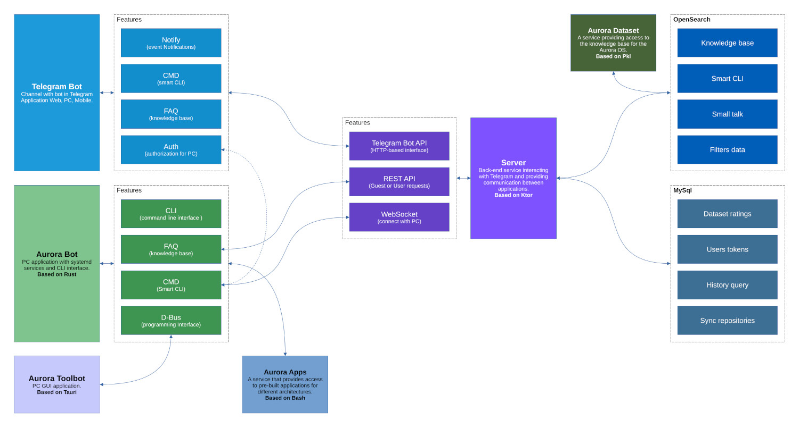

# Aurora Bot

> Subscribe and like ⭐

The application that simplifies interaction with the [Aurora OS](https://auroraos.ru/) infrastructure for software development.


### Features

- Interacting with devices.
- Interacting with emulators.
- Working with [Aurora SDK](https://developer.auroraos.ru/doc/sdk).
- Working with [Platform SDK](https://developer.auroraos.ru/doc/sdk/psdk).
- Working with [Flutter SDK](https://developer.auroraos.ru/doc/extended/flutter).
- Answers to questions.

### Architecture



> For use the client service, authorization in the application is required:
> https://aurora-bot.keygenqt.com/book/telegram-bot/auth.html

### Install DEB

> [Download](https://github.com/keygenqt/aurora-bot/releases) DEB package for your OS.

```shell
# Install
sudo dpkg -i aurora-bot_0.1.7-1_amd64-noble.deb
sudo apt-get install -f
# Enable services
systemctl --user enable aurora-bot.client.service
systemctl --user enable aurora-bot.dbus.service
# Start services
systemctl --user start aurora-bot.client.service
systemctl --user start aurora-bot.dbus.service
```

### Install RPM

> [Download](https://github.com/keygenqt/aurora-bot/releases) RPM package for your OS.

```shell
# Install
sudo apt-get install aurora-bot-0.1.7-1.x86_64-alt11.rpm
# Enable services
systemctl --user enable aurora-bot.client.service
systemctl --user enable aurora-bot.dbus.service
# Start services
systemctl --user start aurora-bot.client.service
systemctl --user start aurora-bot.dbus.service
```

### Install Cargo

🔗 [https://crates.io/crates/aurora-bot](https://crates.io/crates/aurora-bot)

> [Download](https://github.com/keygenqt/aurora-bot/tree/main/build/systemd) services to `/etc/systemd/user`.

```shell
# Install dependency
sudo apt-get install \
    clang \
    libssl-dev \
    libdbus-1-dev \
    libavutil-dev \
    libavcodec-dev \
    libavformat-dev \
    libavfilter-dev \
    libavdevice-dev
# Install app
cargo install aurora-bot
# Enable services
systemctl --user enable aurora-bot.client.service
systemctl --user enable aurora-bot.dbus.service
# Start services
systemctl --user start aurora-bot.client.service
systemctl --user start aurora-bot.dbus.service
```

### License

```
Copyright 2025 Vitaliy Zarubin

Licensed under the Apache License, Version 2.0 (the "License");
you may not use this file except in compliance with the License.
You may obtain a copy of the License at

    https://www.apache.org/licenses/LICENSE-2.0

Unless required by applicable law or agreed to in writing, software
distributed under the License is distributed on an "AS IS" BASIS,
WITHOUT WARRANTIES OR CONDITIONS OF ANY KIND, either express or implied.
See the License for the specific language governing permissions and
limitations under the License.
```
