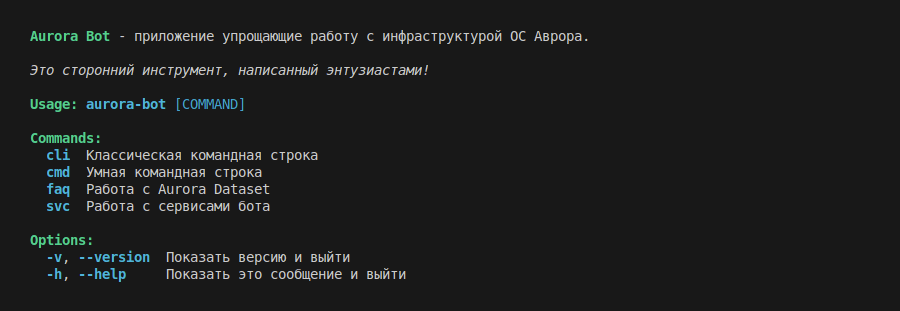

# AuroraBot

> Subscribe and like ⭐

[)](https://github.com/keygenqt/aurora-bot/releases)
[)](https://github.com/keygenqt/aurora-bot/releases)

> The application is under development.

Fast, smart, lightweight, client of the Aurora Bot project.



### Features

- `cli` - Classic command line.
- `cmd` - Smart command line.
- `faq` - Answers on the Aurora OS ecosystem.
- `svc` - Services: dbus api, telegram client.

### Todo

- Install psdk (psdk_install).
- Remove psdk (psdk_remove).

### Architecture


### Install DEB

```shell
# Install
sudo dpkg -i aurora-bot_0.1.0-1_amd64.deb
# Enable services
systemctl --user enable aurora-bot.client.service
systemctl --user enable aurora-bot.dbus.service
```

### Install TAR

1. Download and unzip the archive
2. Copy `bin/*` to `/usr/local/bin`
3. Copy `systemd/*` services to `/etc/systemd/user`
4. Enable services
   - `systemctl --user enable aurora-bot.client.service`
   - `systemctl --user enable aurora-bot.client.service`

### License

```
Copyright 2025 Vitaliy Zarubin

Licensed under the Apache License, Version 2.0 (the "License");
you may not use this file except in compliance with the License.
You may obtain a copy of the License at

    https://www.apache.org/licenses/LICENSE-2.0

Unless required by applicable law or agreed to in writing, software
distributed under the License is distributed on an "AS IS" BASIS,
WITHOUT WARRANTIES OR CONDITIONS OF ANY KIND, either express or implied.
See the License for the specific language governing permissions and
limitations under the License.
```
