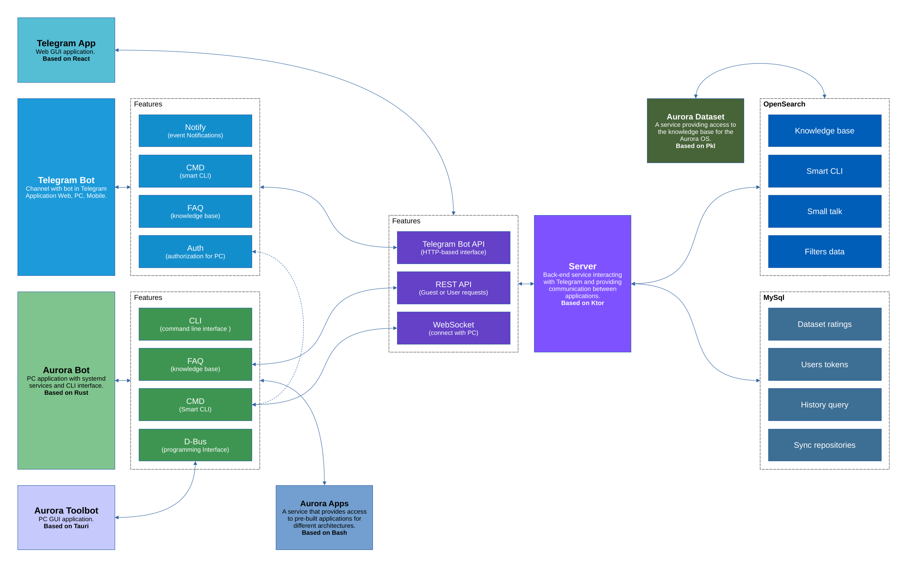

# AuroraBot

Fast, smart, easy, fast way to interact with Aurora OS.

### Features

- `cli` - Classic command line.
- `cmd` - Smart command line.
- `faq` - Answers on the Aurora OS ecosystem.
- `svc` - Services: dbus api, telegram client.

[More...](https://aurora-bot.keygenqt.com/book/aurora-bot/about.html)

### Architecture

